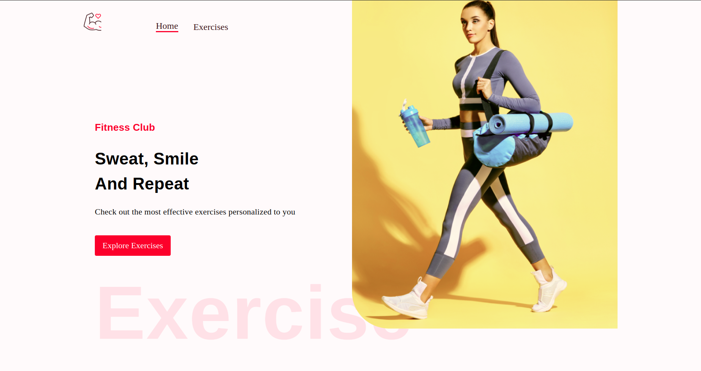

# BChainDev
A home gym application that gives many exercise ideas by seraching different peramiters like bodyparts. You'll be able to fine tune your workouts and discover new ways to exercise

## Screenshot:



## Built with:

React.JS
MaterialUI
TailwindCSS
RapidAPI

## How to use?
First, run the development server:

```bash
npm install
npm start

Open (http://localhost:3000) with your browser to see the result.

## Contribute:
Feel free to a fork the repo or notify me of any issues that are present

## Credit:

JavascriptMastery's tutorial helped me create this project:
https://www.youtube.com/watch?v=dyFVwXROzZk&t=12601s

## License:

MIT © BChainDev
